# MyKubernetes

My Kubernetes

## URLs

GitHub

https://github.com/chance2021/dk-devops-review-quiz

Attendance

https://docs.google.com/spreadsheets/d/1ycnDY6OF1UFTYxSq2lWlQo0y-g6Ozko1KRAQysBQOPg/edit#gid=0

## Week 1/18, 2022-02-10

https://docs.google.com/forms/d/e/1FAIpQLScBSHWlre-Zl5uEx5SpWQftefvQt_sJhFWvQvV2LOeoZrEJ3Q/viewform?vc=0&c=0&w=1&flr=0

->

https://docs.google.com/forms/d/e/1FAIpQLScBSHWlre-Zl5uEx5SpWQftefvQt_sJhFWvQvV2LOeoZrEJ3Q/viewscore?viewscore=AE0zAgBOpgVaLkdMc83-L5-58dvCY_AbOHtb1nJw11SvXkTmjaW4I0yN267DzzD_Qv5le3A

https://kubernetes.io/docs/concepts/overview/components/

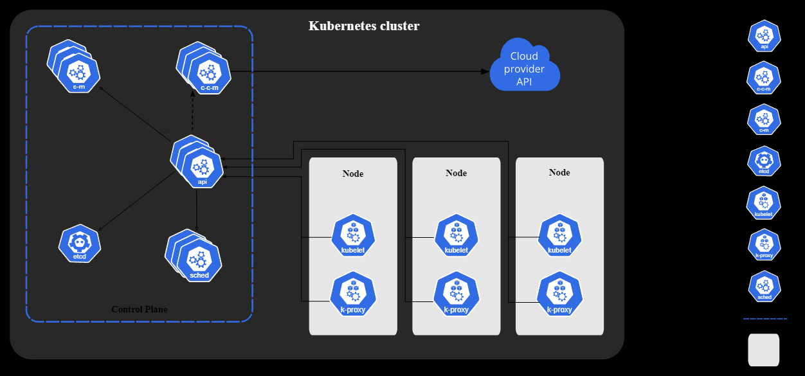

Control Plane Components

- kube-apiserver
- etcd
- kube-scheduler
- kube-controller-manager
- cloud-controller-manager

Node Components

- kubelet
- kube-proxy
- Container runtime

kubectl translates your imperative command into a declarative Kubernetes Deployment object.

There are two basic ways to deploy to Kubernetes: imperatively, with the many kubectl commands, or declaratively, by writing manifests and using `kubectl apply`.

How to deploy a database on Kubernetes

Now, let’s dive into more details on how to deploy a database on Kubernetes using StatefulSets. With a StatefulSet, your data can be stored on persistent volumes, decoupling the database application from the persistent storage, so when a pod (such as the database application) is recreated, all the data is still there. Additionally, when a pod is recreated in a StatefulSet, it keeps the same name, so you have a consistent endpoint to connect to. Persistent data and consistent naming are two of the largest benefits of StatefulSets. You can check out the Kubernetes documentation for more details.

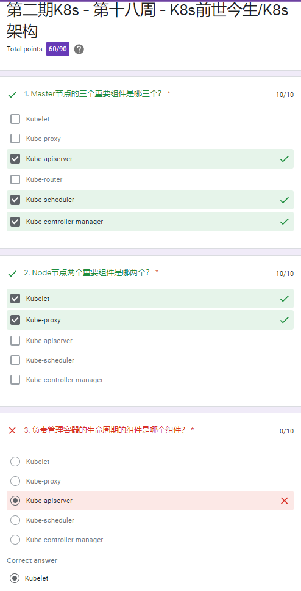

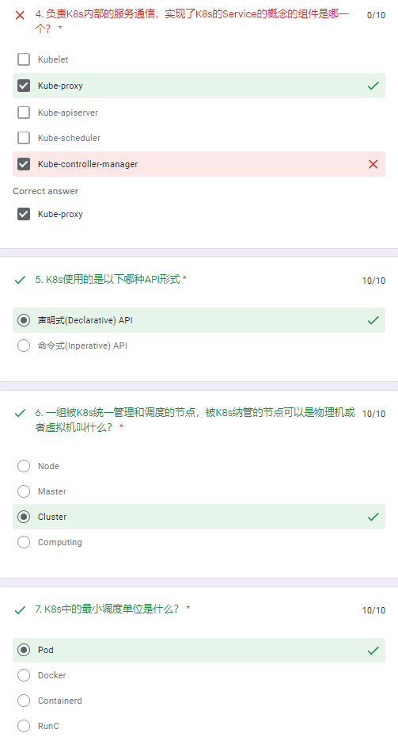

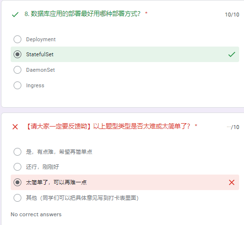

## Week 2/19, 2022-02-17

https://docs.google.com/forms/d/e/1FAIpQLSeSrGJTolsj2dO8Q-Xu0uKn1QW3Dr9QHw0vVEjhxTa-sWsLiA/viewform?vc=0&c=0&w=1&flr=0

->

https://docs.google.com/forms/d/e/1FAIpQLSeSrGJTolsj2dO8Q-Xu0uKn1QW3Dr9QHw0vVEjhxTa-sWsLiA/viewscore?viewscore=AE0zAgBLjjH1i67JJiUBIuaqLGzzgkAsGQe8dpkWMo_Qk5dZBzzfw3VER7ixsYmigHiGw0s

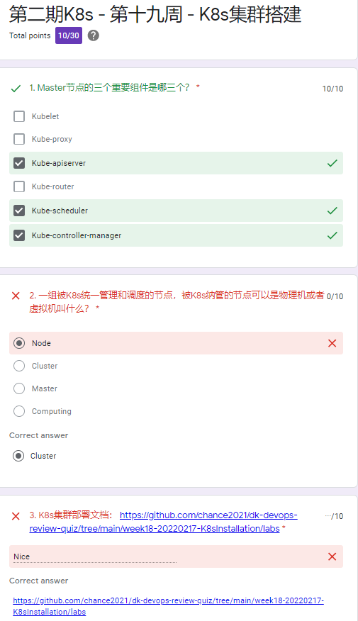

## Week 3/20, 2022-02-24

https://docs.google.com/forms/d/e/1FAIpQLSdWy73MttPztC5Hrgohfnpxr4FPUbP45rGue68awceeW_kTxg/viewform?vc=0&c=0&w=1&flr=0

->

https://docs.google.com/forms/d/e/1FAIpQLSdWy73MttPztC5Hrgohfnpxr4FPUbP45rGue68awceeW_kTxg/viewscore?viewscore=AE0zAgDRKfsIMMH99WMqsY6-pYNs2L5Qwo5Vicv08Qp9Ugl6TULY9sqDCfDjuVLmzzvz5vI

Kubernetes Playground

https://www.katacoda.com/courses/kubernetes/playground

https://www.katacoda.com/courses/kubernetes/getting-started-with-kubeadm

```
kubeadm init --token=102952.1a7dd4cc8d1f4cc5 --kubernetes-version $(kubeadm version -o short)
sudo cp /etc/kubernetes/admin.conf $HOME/
sudo chown $(id -u):$(id -g) $HOME/admin.conf
export KUBECONFIG=$HOME/admin.conf
kubeadm join 172.17.0.89:6443 --token ztdjrf.rjqmz9tkgxbj2wd7     --discovery-token-ca-cert-hash sha256:3ca84e1f403d11b80f514ac2d8019c7e238952c6b274b5b08f735fbd4671c792
kubectl get nodes
```

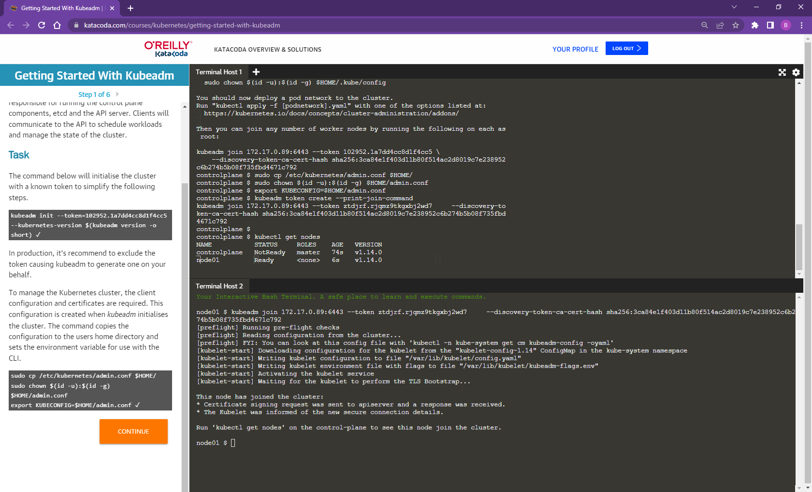

Within a Pod, containers share an IP address and port space, and can find each other via localhost . The containers in a Pod can also communicate with each other using standard inter-process communications like SystemV semaphores or POSIX shared memory.

Containers within same pod share network namespace and IPC namespace but they have separate mount namespace and filesystem.

Node Pod

A Pod always runs on a Node. A Node is a worker machine in Kubernetes and may be either a virtual or a physical machine, depending on the cluster. Each Node is managed by the control plane.

What is cluster node and pod?

Cluster. A cluster consists of one master machine and multiple worker machines or nodes. The master coordinates between all the nodes. Pod. A pod is the smallest unit of a cluster.

```
controlplane $ kubectl get pods --all-namespaces -o jsonpath="{.items[*].spec.containers[*].image}"
k8s.gcr.io/coredns:1.3.1
k8s.gcr.io/coredns:1.3.1
k8s.gcr.io/etcd:3.3.10
k8s.gcr.io/kube-apiserver:v1.14.0
k8s.gcr.io/kube-controller-manager:v1.14.0
k8s.gcr.io/kube-proxy:v1.14.0
k8s.gcr.io/kube-proxy:v1.14.0
k8s.gcr.io/kube-scheduler:v1.14.0
weaveworks/weave-kube:2.8.1
weaveworks/weave-npc:2.8.1
weaveworks/weave-kube:2.8.1
weaveworks/weave-npc:2.8.1
nginx
nginx2
redis
redis123
```

```
controlplane $ kubectl get pods --all-namespaces -o jsonpath='{range .items[*]}{containers[*]}{.image}{", "}{end}{end}' | sort

coredns-fb8b8dccf-8wf72:        k8s.gcr.io/coredns:1.3.1,
coredns-fb8b8dccf-9xf5w:        k8s.gcr.io/coredns:1.3.1,
etcd-controlplane:      k8s.gcr.io/etcd:3.3.10,
kube-apiserver-controlplane:    k8s.gcr.io/kube-apiserver:v1.14.0,
kube-controller-manager-controlplane:   k8s.gcr.io/kube-controller-manager:v1.14.0,
kube-proxy-d8695:       k8s.gcr.io/kube-proxy:v1.14.0,
kube-proxy-gs9rq:       k8s.gcr.io/kube-proxy:v1.14.0,
kube-scheduler-controlplane:    k8s.gcr.io/kube-scheduler:v1.14.0,
test1-7687c59456-nm6bb: nginx,
test2-f86cb7678-mbqzq:  nginx2,
test3-78ff9dcdc7-kmfq8: redis,
test4-6dc9786c67-rxv7w: redis123,
weave-net-h895d:        weaveworks/weave-kube:2.8.1, weaveworks/weave-npc:2.8.1,
weave-net-s72t6:        weaveworks/weave-kube:2.8.1, weaveworks/weave-npc:2.8.1,
```

```
#!/bin/bash

# Deploy Network plugin
kubectl apply -f https://github.com/weaveworks/weave/releases/download/v2.8.1/weave-daemonset-k8s-1.11.yaml

# Create a namespace
kubectl create ns mynamespace

# Create Pods
kubectl run test1 --image=nginx -n mynamespace
kubectl run test2 --image=nginx2 -n mynamespace
kubectl run test3 --image=redis -n mynamespace
kubectl run test4 --image=redis123 -n mynamespace

clear
echo "Please wait 15s for the environment setup..."
sleep 15s
echo ""
echo ""
```

```
kubectl run test5 --image=nginx -n mynamespace
```

???

```
kubectl -n mynamespace run test5 --image nginx
```

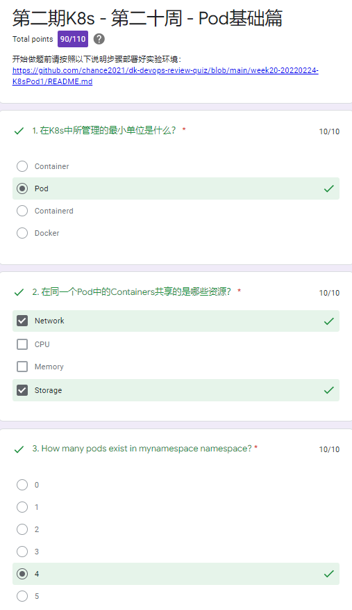

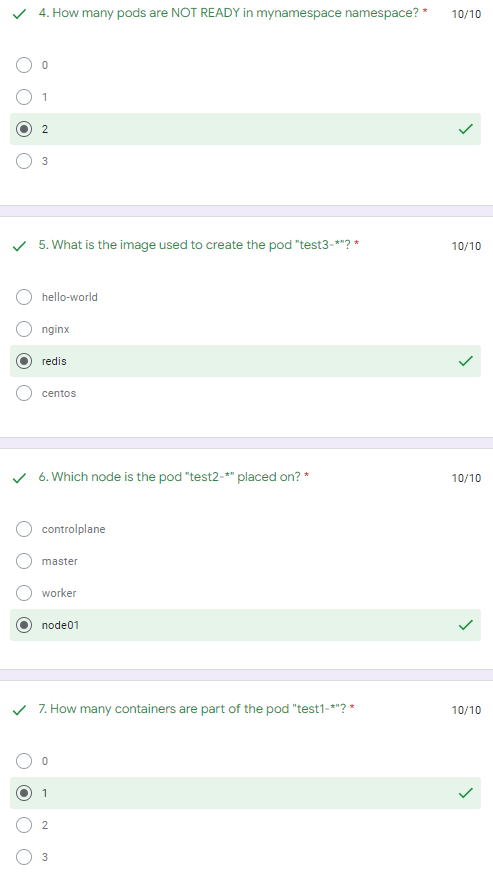

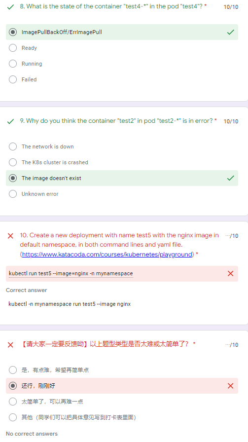

Use k for kubectl?

Use `describe` to check details -

```
k describe pods test3-... -n mynamespace
```

```
docker commit ... ...
```

If can't find pod logs, try to find the docker logs.

i.e. use `docker cp ...` to copy the log out.

0/1 means this pod has 1 container and 0 container is ready.

There are many reasons can cause "ImagePullBackOff" error.

## Week 4/21, 2022-03-03

https://docs.google.com/forms/d/e/1FAIpQLSeKY2uh-VCN-tjGYByAAaEKin4e2izK9Axgq0wu79IjKfO2Ow/viewform?vc=0&c=0&w=1&flr=0

->

https://docs.google.com/forms/d/e/1FAIpQLSeKY2uh-VCN-tjGYByAAaEKin4e2izK9Axgq0wu79IjKfO2Ow/viewscore?viewscore=AE0zAgCaQwHkn5AXlikFTIXiJVMnCN3PuPszQL0slpr20EYa3wQFBg_4elvTUtujNISbXJM

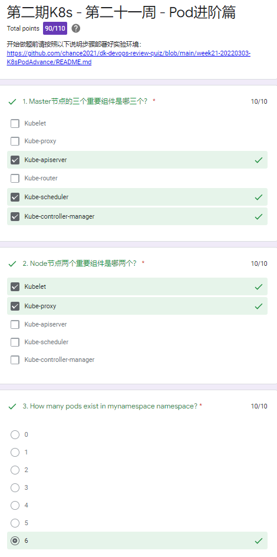

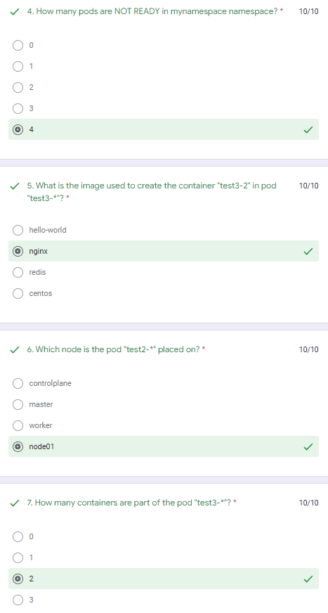

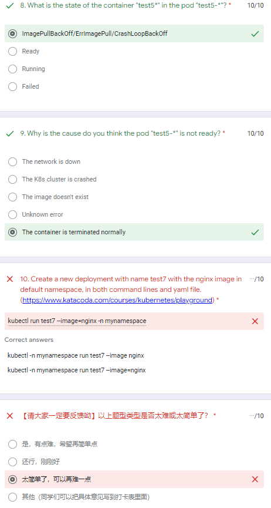

setup.sh

```
#!/bin/bash

# Deploy Network plugin
kubectl apply -f https://github.com/weaveworks/weave/releases/download/v2.8.1/weave-daemonset-k8s-1.11.yaml

# Create a namespace
kubectl create ns mynamespace

# Create Pods
kubectl run test1 --image=nginx -n mynamespace
cat <<EOF | kubectl apply -f -
apiVersion: v1
kind: Pod
metadata:
  creationTimestamp: null
  labels:
    run: test2
  name: test2
  namespace: mynamespace
spec:
  containers:
  - image: nginx2
    name: test2
  - image: hello-world
    name: test2-1
EOF

cat <<EOF | kubectl apply -f -
apiVersion: v1
kind: Pod
metadata:
  creationTimestamp: null
  labels:
    run: test3
  name: test3
  namespace: mynamespace
spec:
  containers:
  - image: redis
    name: test3
  - image: nginx
    name: test3-2
EOF
kubectl run test4 --image=redis123 -n mynamespace
kubectl run test5 --image=hello-world -n mynamespace
kubectl run test6 --image=centos8 -n mynamespace

clear
echo "Please wait 15s for the environment setup..."
sleep 15s
```

Output:

```
node01 $ kubeadm join 172.17.0.62:6443 --token o2yjux.2ph5qznlo57qghfk     --discovery-token-ca-cert-hash sha256:f4928f259d5efcb9423adeb4b714e233375236bb445079b260cb90dbda314897
[preflight] Running pre-flight checks
[preflight] Reading configuration from the cluster...
[preflight] FYI: You can look at this config file with 'kubectl -n kube-system get cm kubeadm-config -oyaml'
[kubelet-start] Downloading configuration for the kubelet from the "kubelet-config-1.14" ConfigMap in the kube-system namespace
[kubelet-start] Writing kubelet configuration to file "/var/lib/kubelet/config.yaml"
[kubelet-start] Writing kubelet environment file with flags to file "/var/lib/kubelet/kubeadm-flags.env"
[kubelet-start] Activating the kubelet service
[kubelet-start] Waiting for the kubelet to perform the TLS Bootstrap...

This node has joined the cluster:
* Certificate signing request was sent to apiserver and a response was received.
* The Kubelet was informed of the new secure connection details.

Run 'kubectl get nodes' on the control-plane to see this node join the cluster.
```

```

controlplane $ k describe pods test3 -n mynamespace
Name:               test3
Namespace:          mynamespace
Priority:           0
PriorityClassName:  <none>
Node:               node01/172.17.0.63
Start Time:         Mon, 07 Mar 2022 11:20:59 +0000
Labels:             run=test3
Annotations:        kubectl.kubernetes.io/last-applied-configuration:
                      {"apiVersion":"v1","kind":"Pod","metadata":{"annotations":{},"creationTimestamp":null,"labels":{"run":"test3"},"name":"test3","namespace":...
Status:             Running
IP:                 10.88.0.6
Containers:
  test3:
    Container ID:   docker://2956318b36c7a796e5a6864d00261c0df5ca8850f81182791417ba10ed740251
    Image:          redis
    Image ID:       docker-pullable://redis@sha256:feb846600a248be6e6afbad39bf5b91afaef1de5524fd85b9b53839d0fd4af96
    Port:           <none>
    Host Port:      <none>
    State:          Running
      Started:      Mon, 07 Mar 2022 11:22:07 +0000
    Ready:          True
    Restart Count:  0
    Environment:    <none>
    Mounts:
      /var/run/secrets/kubernetes.io/serviceaccount from default-token-z4c5h (ro)
  test3-2:
    Container ID:   docker://56bb64d0087e5369aa02ff774ad5720d76f0b10eba055377ff89152f39f226e7
    Image:          nginx
    Image ID:       docker-pullable://nginx@sha256:1c13bc6de5dfca749c377974146ac05256791ca2fe1979fc8e8278bf0121d285
    Port:           <none>
    Host Port:      <none>
    State:          Running
      Started:      Mon, 07 Mar 2022 11:22:24 +0000
    Ready:          True
    Restart Count:  0
    Environment:    <none>
    Mounts:
      /var/run/secrets/kubernetes.io/serviceaccount from default-token-z4c5h (ro)
Conditions:
  Type              Status
  Initialized       True
  Ready             True
  ContainersReady   True
  PodScheduled      True
Volumes:
  default-token-z4c5h:
    Type:        Secret (a volume populated by a Secret)
    SecretName:  default-token-z4c5h
    Optional:    false
QoS Class:       BestEffort
Node-Selectors:  <none>
Tolerations:     node.kubernetes.io/not-ready:NoExecute for 300s
                 node.kubernetes.io/unreachable:NoExecute for 300s
Events:
  Type    Reason     Age   From               Message
  ----    ------     ----  ----               -------
  Normal  Scheduled  13m   default-scheduler  Successfully assigned mynamespace/test3 to node01
  Normal  Pulling    13m   kubelet, node01    Pulling image "redis"
  Normal  Pulled     12m   kubelet, node01    Successfully pulled image "redis"
  Normal  Created    12m   kubelet, node01    Created container test3
  Normal  Started    12m   kubelet, node01    Started container test3
  Normal  Pulling    12m   kubelet, node01    Pulling image "nginx"
  Normal  Pulled     12m   kubelet, node01    Successfully pulled image "nginx"
  Normal  Created    12m   kubelet, node01    Created container test3-2
  Normal  Started    12m   kubelet, node01    Started container test3-2
controlplane $
```

```
controlplane $ k describe pods test5-7bbb9467f5-xscnb -n mynamespace
Name:               test5-7bbb9467f5-xscnb
Namespace:          mynamespace
Priority:           0
PriorityClassName:  <none>
Node:               node01/172.17.0.63
Start Time:         Mon, 07 Mar 2022 11:21:01 +0000
Labels:             pod-template-hash=7bbb9467f5
                    run=test5
Annotations:        <none>
Status:             Running
IP:                 10.88.0.8
Controlled By:      ReplicaSet/test5-7bbb9467f5
Containers:
  test5:
    Container ID:   docker://9704a0c7a5b17abff2755abc5a445dc042321d3aff8d163ad1e40b4270405dac
    Image:          hello-world
    Image ID:       docker-pullable://hello-world@sha256:97a379f4f88575512824f3b352bc03cd75e239179eea0fecc38e597b2209f49a
    Port:           <none>
    Host Port:      <none>
    State:          Waiting
      Reason:       CrashLoopBackOff
    Last State:     Terminated
      Reason:       Completed
      Exit Code:    0
      Started:      Mon, 07 Mar 2022 11:33:31 +0000
      Finished:     Mon, 07 Mar 2022 11:33:31 +0000
    Ready:          False
    Restart Count:  7
    Environment:    <none>
    Mounts:
      /var/run/secrets/kubernetes.io/serviceaccount from default-token-z4c5h (ro)
Conditions:
  Type              Status
  Initialized       True
  Ready             False
  ContainersReady   False
  PodScheduled      True
Volumes:
  default-token-z4c5h:
    Type:        Secret (a volume populated by a Secret)
    SecretName:  default-token-z4c5h
    Optional:    false
QoS Class:       BestEffort
Node-Selectors:  <none>
Tolerations:     node.kubernetes.io/not-ready:NoExecute for 300s
                 node.kubernetes.io/unreachable:NoExecute for 300s
Events:
  Type     Reason     Age                  From               Message
  ----     ------     ----                 ----               -------
  Normal   Scheduled  17m                  default-scheduler  Successfully assigned mynamespace/test5-7bbb9467f5-xscnb to node01
  Normal   Created    14m (x4 over 15m)    kubelet, node01    Created container test5
  Normal   Started    14m (x4 over 15m)    kubelet, node01    Started container test5
  Normal   Pulling    14m (x5 over 16m)    kubelet, node01    Pulling image "hello-world"
  Normal   Pulled     14m (x5 over 15m)    kubelet, node01    Successfully pulled image "hello-world"
  Warning  BackOff    101s (x64 over 15m)  kubelet, node01    Back-off restarting failed container
controlplane $
```

A CrashloopBackOff means that you have a pod starting, crashing, starting again, and then crashing again.

Why does a CrashLoopBackOff occur?

A quick Google search will show us that crash loop events can happen for a number of different reasons (and they happen frequently). Here are some of the umbrella causes for why they occur:

- The application inside the container keeps crashing
- Some type of parameters of the pod or container have been configured incorrectly
- An error has been made when deploying Kubernetes

If you receive the "Back-Off restarting failed container" output message, then your container probably exited soon after Kubernetes started the container. If the Liveness probe isn't returning a successful status, then verify that the Liveness probe is configured correctly for the application.

## Week 5/22, 2022-03-10

https://docs.google.com/forms/d/e/1FAIpQLSeWGy3yW3glJkfVW0aVnRrR8WpqBXxKYNIss9PoJUK9t1IG0g/viewform?vc=0&c=0&w=1&flr=0

->

https://docs.google.com/forms/d/e/1FAIpQLSeWGy3yW3glJkfVW0aVnRrR8WpqBXxKYNIss9PoJUK9t1IG0g/viewscore?viewscore=AE0zAgBjzGDAKoJOiwXULSYJ2U6gpGn9a4wkw5wORl0AgeR2nrYIm86B1A88V0iK6hqX-ro

YAML excels at working with mappings (hashes / dictionaries), sequences (arrays / lists), and scalars (strings / numbers)

Overview of data types in YAML

- Integers.
- Floating point.
- String.
- Null.
- Timestamp.
- Arrays or List.

The command below will initialise the cluster with a known token to simplify the following steps.

```
kubeadm init --token=102952.1a7dd4cc8d1f4cc5 --kubernetes-version $(kubeadm version -o short)
```

In production, it's recommend to exclude the token causing kubeadm to generate one on your behalf.

To manage the Kubernetes cluster, the client configuration and certificates are required. This configuration is created when kubeadm initialises the cluster. The command copies the configuration to the users home directory and sets the environment variable for use with the CLI.

```
sudo cp /etc/kubernetes/admin.conf $HOME/
sudo chown $(id -u):$(id -g) $HOME/admin.conf
export KUBECONFIG=$HOME/admin.conf
```

ReplicaSets

```
kubectl get rs -n mynamespace
```

set the current namespace

```
kubectl config set-context --current --namespace=mynamespace
```

Delete a replica set

```
controlplane $ k get rs
NAME               DESIRED   CURRENT   READY   AGE
test1-7687c59456   1         1         1       24m
test4-6dc9786c67   1         1         0       24m
test5-7bbb9467f5   1         1         0       24m
test6-dc4f8cf6d    1         1         0       24m
test7-8576567f89   3         3         3       24m
test8-7f64d968b8   1         1         0       24m
controlplane $ k delete rs test7-8576567f89
replicaset.extensions "test7-8576567f89" deleted
controlplane $ k get rs
NAME               DESIRED   CURRENT   READY   AGE
test1-7687c59456   1         1         1       24m
test4-6dc9786c67   1         1         0       24m
test5-7bbb9467f5   1         1         0       24m
test6-dc4f8cf6d    1         1         0       24m
test7-8576567f89   3         3         0       4s
test8-7f64d968b8   1         1         0       24m
```

test9-pod.yaml

```
apiVersion: apps/v1
kind: ReplicaSet
metadata:
  name: test9
  namespace: mynamespace
spec:
  replicas: 2
  selector:
    matchLabels:
      tier: frontend
  template:
    metadata:
      labels:
        tier: frontend
    spec:
      containers:
      - name: nginx
        image: nginx
```

test10-pod.yaml

```
apiVersion: apps/v1
kind: ReplicaSet
metadata:
  name: test10
  namespace: mynamespace
spec:
  replicas: 2
  selector:
    matchLabels:
      tier: frontend
  template:
    metadata:
      labels:
        tier: frontend
    spec:
      containers:
      - name: nginx
        image: nginx
```

new test9-pod.yaml

```
apiVersion: apps/v1
kind: ReplicaSet
metadata:
  name: test9
  namespace: mynamespace
spec:
  replicas: 2
  selector:
    matchLabels:
      tier: frontend
  template:
    metadata:
      labels:
        tier: frontend
    spec:
      containers:
      - name: redis
        image: redis
```

kubectl create deployment test9 --image=nginx -n mynamespace

kubectl create deployment test10 --image=nginx -n mynamespace

kubectl replace -f test9-pod.yaml

kubectl scale deployment test10 --replicas=5 -n mynamespace

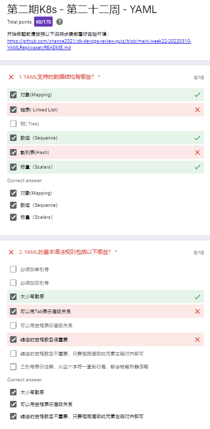

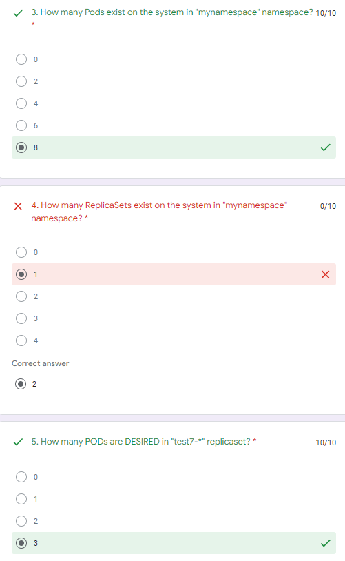

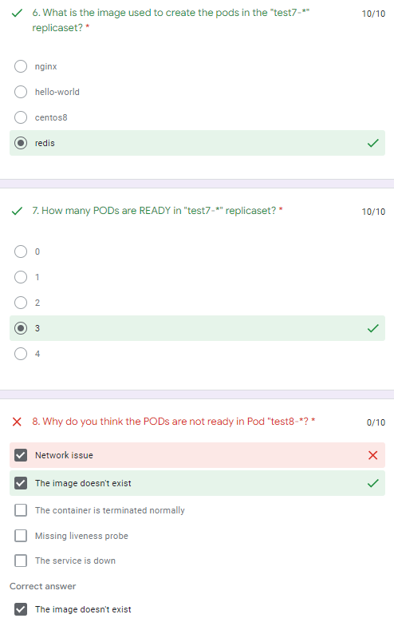

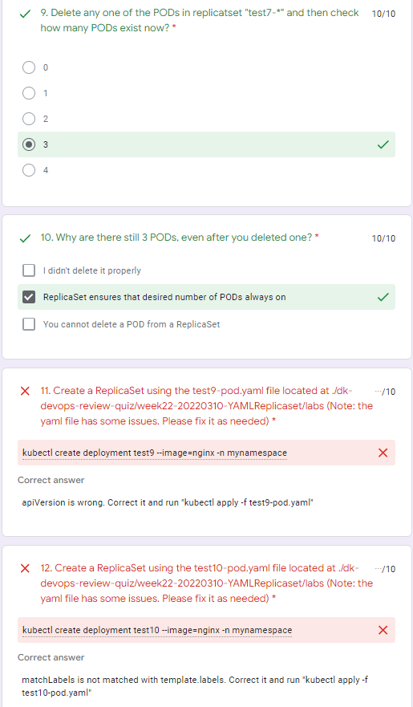

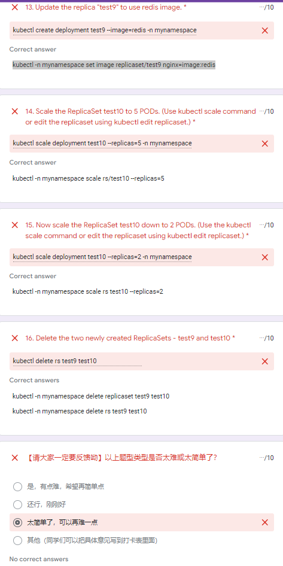

```
alias k=kubectl

k get rs <rs_name> -o yaml
```

apply is better than create and replace.

## Week 6/22, 2022-03-17

?

->

?

## Week?/??, 2022-0x-xx

https://docs.google.com/forms/d/e/1FAIpQLSeSrGJTolsj2dO8Q-Xu0uKn1QW3Dr9QHw0vVEjhxTa-sWsLiA/viewform?vc=0&c=0&w=1&flr=0

->

https://docs.google.com/forms/d/e/1FAIpQLSeSrGJTolsj2dO8Q-Xu0uKn1QW3Dr9QHw0vVEjhxTa-sWsLiA/viewscore?viewscore=AE0zAgBLjjH1i67JJiUBIuaqLGzzgkAsGQe8dpkWMo_Qk5dZBzzfw3VER7ixsYmigHiGw0s


## Ref
