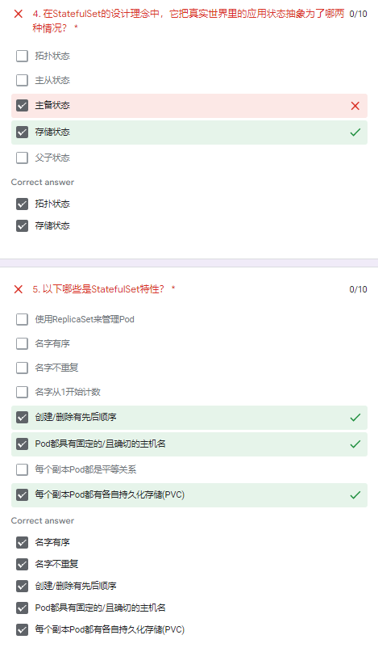

# MyKubernetes

My Kubernetes

## URLs

GitHub

https://github.com/chance2021/dk-devops-review-quiz

Attendance

https://docs.google.com/spreadsheets/d/1ycnDY6OF1UFTYxSq2lWlQo0y-g6Ozko1KRAQysBQOPg/edit#gid=0

```
alias k=kubectl
```

```
kubectl config set-context --current --namespace=mynamespace
```

## Week 1/18, 2022-02-10

https://docs.google.com/forms/d/e/1FAIpQLScBSHWlre-Zl5uEx5SpWQftefvQt_sJhFWvQvV2LOeoZrEJ3Q/viewform?vc=0&c=0&w=1&flr=0

->

https://docs.google.com/forms/d/e/1FAIpQLScBSHWlre-Zl5uEx5SpWQftefvQt_sJhFWvQvV2LOeoZrEJ3Q/viewscore?viewscore=AE0zAgBOpgVaLkdMc83-L5-58dvCY_AbOHtb1nJw11SvXkTmjaW4I0yN267DzzD_Qv5le3A

https://kubernetes.io/docs/concepts/overview/components/


Control Plane Components

- kube-apiserver
- etcd
- kube-scheduler
- kube-controller-manager
- cloud-controller-manager

Node Components

- kubelet
- kube-proxy
- Container runtime

kubectl translates your imperative command into a declarative Kubernetes Deployment object.

There are two basic ways to deploy to Kubernetes: imperatively, with the many kubectl commands, or declaratively, by writing manifests and using `kubectl apply`.

How to deploy a database on Kubernetes

Now, let’s dive into more details on how to deploy a database on Kubernetes using StatefulSets. With a StatefulSet, your data can be stored on persistent volumes, decoupling the database application from the persistent storage, so when a pod (such as the database application) is recreated, all the data is still there. Additionally, when a pod is recreated in a StatefulSet, it keeps the same name, so you have a consistent endpoint to connect to. Persistent data and consistent naming are two of the largest benefits of StatefulSets. You can check out the Kubernetes documentation for more details.


## Week 2/19, 2022-02-17

https://docs.google.com/forms/d/e/1FAIpQLSeSrGJTolsj2dO8Q-Xu0uKn1QW3Dr9QHw0vVEjhxTa-sWsLiA/viewform?vc=0&c=0&w=1&flr=0

->

https://docs.google.com/forms/d/e/1FAIpQLSeSrGJTolsj2dO8Q-Xu0uKn1QW3Dr9QHw0vVEjhxTa-sWsLiA/viewscore?viewscore=AE0zAgBLjjH1i67JJiUBIuaqLGzzgkAsGQe8dpkWMo_Qk5dZBzzfw3VER7ixsYmigHiGw0s


## Week 3/20, 2022-02-24

https://docs.google.com/forms/d/e/1FAIpQLSdWy73MttPztC5Hrgohfnpxr4FPUbP45rGue68awceeW_kTxg/viewform?vc=0&c=0&w=1&flr=0

->

https://docs.google.com/forms/d/e/1FAIpQLSdWy73MttPztC5Hrgohfnpxr4FPUbP45rGue68awceeW_kTxg/viewscore?viewscore=AE0zAgDRKfsIMMH99WMqsY6-pYNs2L5Qwo5Vicv08Qp9Ugl6TULY9sqDCfDjuVLmzzvz5vI

Kubernetes Playground

https://www.katacoda.com/courses/kubernetes/playground

https://www.katacoda.com/courses/kubernetes/getting-started-with-kubeadm

```
kubeadm init --token=102952.1a7dd4cc8d1f4cc5 --kubernetes-version $(kubeadm version -o short)
sudo cp /etc/kubernetes/admin.conf $HOME/
sudo chown $(id -u):$(id -g) $HOME/admin.conf
export KUBECONFIG=$HOME/admin.conf
kubeadm join 172.17.0.89:6443 --token ztdjrf.rjqmz9tkgxbj2wd7     --discovery-token-ca-cert-hash sha256:3ca84e1f403d11b80f514ac2d8019c7e238952c6b274b5b08f735fbd4671c792
kubectl get nodes
```


Within a Pod, containers share an IP address and port space, and can find each other via localhost . The containers in a Pod can also communicate with each other using standard inter-process communications like SystemV semaphores or POSIX shared memory.

Containers within same pod share network namespace and IPC namespace but they have separate mount namespace and filesystem.

Node Pod

A Pod always runs on a Node. A Node is a worker machine in Kubernetes and may be either a virtual or a physical machine, depending on the cluster. Each Node is managed by the control plane.

What is cluster node and pod?

Cluster. A cluster consists of one master machine and multiple worker machines or nodes. The master coordinates between all the nodes. Pod. A pod is the smallest unit of a cluster.

```
controlplane $ kubectl get pods --all-namespaces -o jsonpath="{.items[*].spec.containers[*].image}"
k8s.gcr.io/coredns:1.3.1
k8s.gcr.io/coredns:1.3.1
k8s.gcr.io/etcd:3.3.10
k8s.gcr.io/kube-apiserver:v1.14.0
k8s.gcr.io/kube-controller-manager:v1.14.0
k8s.gcr.io/kube-proxy:v1.14.0
k8s.gcr.io/kube-proxy:v1.14.0
k8s.gcr.io/kube-scheduler:v1.14.0
weaveworks/weave-kube:2.8.1
weaveworks/weave-npc:2.8.1
weaveworks/weave-kube:2.8.1
weaveworks/weave-npc:2.8.1
nginx
nginx2
redis
redis123
```

```
controlplane $ kubectl get pods --all-namespaces -o jsonpath='{range .items[*]}{containers[*]}{.image}{", "}{end}{end}' | sort

coredns-fb8b8dccf-8wf72:        k8s.gcr.io/coredns:1.3.1,
coredns-fb8b8dccf-9xf5w:        k8s.gcr.io/coredns:1.3.1,
etcd-controlplane:      k8s.gcr.io/etcd:3.3.10,
kube-apiserver-controlplane:    k8s.gcr.io/kube-apiserver:v1.14.0,
kube-controller-manager-controlplane:   k8s.gcr.io/kube-controller-manager:v1.14.0,
kube-proxy-d8695:       k8s.gcr.io/kube-proxy:v1.14.0,
kube-proxy-gs9rq:       k8s.gcr.io/kube-proxy:v1.14.0,
kube-scheduler-controlplane:    k8s.gcr.io/kube-scheduler:v1.14.0,
test1-7687c59456-nm6bb: nginx,
test2-f86cb7678-mbqzq:  nginx2,
test3-78ff9dcdc7-kmfq8: redis,
test4-6dc9786c67-rxv7w: redis123,
weave-net-h895d:        weaveworks/weave-kube:2.8.1, weaveworks/weave-npc:2.8.1,
weave-net-s72t6:        weaveworks/weave-kube:2.8.1, weaveworks/weave-npc:2.8.1,
```

```
#!/bin/bash

# Deploy Network plugin
kubectl apply -f https://github.com/weaveworks/weave/releases/download/v2.8.1/weave-daemonset-k8s-1.11.yaml

# Create a namespace
kubectl create ns mynamespace

# Create Pods
kubectl run test1 --image=nginx -n mynamespace
kubectl run test2 --image=nginx2 -n mynamespace
kubectl run test3 --image=redis -n mynamespace
kubectl run test4 --image=redis123 -n mynamespace

clear
echo "Please wait 15s for the environment setup..."
sleep 15s
echo ""
echo ""
```

```
kubectl run test5 --image=nginx -n mynamespace
```

???

```
kubectl -n mynamespace run test5 --image nginx
```


Use k for kubectl?

Use `describe` to check details -

```
k describe pods test3-... -n mynamespace
```

```
docker commit ... ...
```

If can't find pod logs, try to find the docker logs.

i.e. use `docker cp ...` to copy the log out.

0/1 means this pod has 1 container and 0 container is ready.

There are many reasons can cause "ImagePullBackOff" error.

## Week 4/21, 2022-03-03

https://docs.google.com/forms/d/e/1FAIpQLSeKY2uh-VCN-tjGYByAAaEKin4e2izK9Axgq0wu79IjKfO2Ow/viewform?vc=0&c=0&w=1&flr=0

->

https://docs.google.com/forms/d/e/1FAIpQLSeKY2uh-VCN-tjGYByAAaEKin4e2izK9Axgq0wu79IjKfO2Ow/viewscore?viewscore=AE0zAgCaQwHkn5AXlikFTIXiJVMnCN3PuPszQL0slpr20EYa3wQFBg_4elvTUtujNISbXJM


setup.sh

```
#!/bin/bash

# Deploy Network plugin
kubectl apply -f https://github.com/weaveworks/weave/releases/download/v2.8.1/weave-daemonset-k8s-1.11.yaml

# Create a namespace
kubectl create ns mynamespace

# Create Pods
kubectl run test1 --image=nginx -n mynamespace
cat <<EOF | kubectl apply -f -
apiVersion: v1
kind: Pod
metadata:
  creationTimestamp: null
  labels:
    run: test2
  name: test2
  namespace: mynamespace
spec:
  containers:
  - image: nginx2
    name: test2
  - image: hello-world
    name: test2-1
EOF

cat <<EOF | kubectl apply -f -
apiVersion: v1
kind: Pod
metadata:
  creationTimestamp: null
  labels:
    run: test3
  name: test3
  namespace: mynamespace
spec:
  containers:
  - image: redis
    name: test3
  - image: nginx
    name: test3-2
EOF
kubectl run test4 --image=redis123 -n mynamespace
kubectl run test5 --image=hello-world -n mynamespace
kubectl run test6 --image=centos8 -n mynamespace

clear
echo "Please wait 15s for the environment setup..."
sleep 15s
```

Output:

```
node01 $ kubeadm join 172.17.0.62:6443 --token o2yjux.2ph5qznlo57qghfk     --discovery-token-ca-cert-hash sha256:f4928f259d5efcb9423adeb4b714e233375236bb445079b260cb90dbda314897
[preflight] Running pre-flight checks
[preflight] Reading configuration from the cluster...
[preflight] FYI: You can look at this config file with 'kubectl -n kube-system get cm kubeadm-config -oyaml'
[kubelet-start] Downloading configuration for the kubelet from the "kubelet-config-1.14" ConfigMap in the kube-system namespace
[kubelet-start] Writing kubelet configuration to file "/var/lib/kubelet/config.yaml"
[kubelet-start] Writing kubelet environment file with flags to file "/var/lib/kubelet/kubeadm-flags.env"
[kubelet-start] Activating the kubelet service
[kubelet-start] Waiting for the kubelet to perform the TLS Bootstrap...

This node has joined the cluster:
* Certificate signing request was sent to apiserver and a response was received.
* The Kubelet was informed of the new secure connection details.

Run 'kubectl get nodes' on the control-plane to see this node join the cluster.
```

```

controlplane $ k describe pods test3 -n mynamespace
Name:               test3
Namespace:          mynamespace
Priority:           0
PriorityClassName:  <none>
Node:               node01/172.17.0.63
Start Time:         Mon, 07 Mar 2022 11:20:59 +0000
Labels:             run=test3
Annotations:        kubectl.kubernetes.io/last-applied-configuration:
                      {"apiVersion":"v1","kind":"Pod","metadata":{"annotations":{},"creationTimestamp":null,"labels":{"run":"test3"},"name":"test3","namespace":...
Status:             Running
IP:                 10.88.0.6
Containers:
  test3:
    Container ID:   docker://2956318b36c7a796e5a6864d00261c0df5ca8850f81182791417ba10ed740251
    Image:          redis
    Image ID:       docker-pullable://redis@sha256:feb846600a248be6e6afbad39bf5b91afaef1de5524fd85b9b53839d0fd4af96
    Port:           <none>
    Host Port:      <none>
    State:          Running
      Started:      Mon, 07 Mar 2022 11:22:07 +0000
    Ready:          True
    Restart Count:  0
    Environment:    <none>
    Mounts:
      /var/run/secrets/kubernetes.io/serviceaccount from default-token-z4c5h (ro)
  test3-2:
    Container ID:   docker://56bb64d0087e5369aa02ff774ad5720d76f0b10eba055377ff89152f39f226e7
    Image:          nginx
    Image ID:       docker-pullable://nginx@sha256:1c13bc6de5dfca749c377974146ac05256791ca2fe1979fc8e8278bf0121d285
    Port:           <none>
    Host Port:      <none>
    State:          Running
      Started:      Mon, 07 Mar 2022 11:22:24 +0000
    Ready:          True
    Restart Count:  0
    Environment:    <none>
    Mounts:
      /var/run/secrets/kubernetes.io/serviceaccount from default-token-z4c5h (ro)
Conditions:
  Type              Status
  Initialized       True
  Ready             True
  ContainersReady   True
  PodScheduled      True
Volumes:
  default-token-z4c5h:
    Type:        Secret (a volume populated by a Secret)
    SecretName:  default-token-z4c5h
    Optional:    false
QoS Class:       BestEffort
Node-Selectors:  <none>
Tolerations:     node.kubernetes.io/not-ready:NoExecute for 300s
                 node.kubernetes.io/unreachable:NoExecute for 300s
Events:
  Type    Reason     Age   From               Message
  ----    ------     ----  ----               -------
  Normal  Scheduled  13m   default-scheduler  Successfully assigned mynamespace/test3 to node01
  Normal  Pulling    13m   kubelet, node01    Pulling image "redis"
  Normal  Pulled     12m   kubelet, node01    Successfully pulled image "redis"
  Normal  Created    12m   kubelet, node01    Created container test3
  Normal  Started    12m   kubelet, node01    Started container test3
  Normal  Pulling    12m   kubelet, node01    Pulling image "nginx"
  Normal  Pulled     12m   kubelet, node01    Successfully pulled image "nginx"
  Normal  Created    12m   kubelet, node01    Created container test3-2
  Normal  Started    12m   kubelet, node01    Started container test3-2
controlplane $
```

```
controlplane $ k describe pods test5-7bbb9467f5-xscnb -n mynamespace
Name:               test5-7bbb9467f5-xscnb
Namespace:          mynamespace
Priority:           0
PriorityClassName:  <none>
Node:               node01/172.17.0.63
Start Time:         Mon, 07 Mar 2022 11:21:01 +0000
Labels:             pod-template-hash=7bbb9467f5
                    run=test5
Annotations:        <none>
Status:             Running
IP:                 10.88.0.8
Controlled By:      ReplicaSet/test5-7bbb9467f5
Containers:
  test5:
    Container ID:   docker://9704a0c7a5b17abff2755abc5a445dc042321d3aff8d163ad1e40b4270405dac
    Image:          hello-world
    Image ID:       docker-pullable://hello-world@sha256:97a379f4f88575512824f3b352bc03cd75e239179eea0fecc38e597b2209f49a
    Port:           <none>
    Host Port:      <none>
    State:          Waiting
      Reason:       CrashLoopBackOff
    Last State:     Terminated
      Reason:       Completed
      Exit Code:    0
      Started:      Mon, 07 Mar 2022 11:33:31 +0000
      Finished:     Mon, 07 Mar 2022 11:33:31 +0000
    Ready:          False
    Restart Count:  7
    Environment:    <none>
    Mounts:
      /var/run/secrets/kubernetes.io/serviceaccount from default-token-z4c5h (ro)
Conditions:
  Type              Status
  Initialized       True
  Ready             False
  ContainersReady   False
  PodScheduled      True
Volumes:
  default-token-z4c5h:
    Type:        Secret (a volume populated by a Secret)
    SecretName:  default-token-z4c5h
    Optional:    false
QoS Class:       BestEffort
Node-Selectors:  <none>
Tolerations:     node.kubernetes.io/not-ready:NoExecute for 300s
                 node.kubernetes.io/unreachable:NoExecute for 300s
Events:
  Type     Reason     Age                  From               Message
  ----     ------     ----                 ----               -------
  Normal   Scheduled  17m                  default-scheduler  Successfully assigned mynamespace/test5-7bbb9467f5-xscnb to node01
  Normal   Created    14m (x4 over 15m)    kubelet, node01    Created container test5
  Normal   Started    14m (x4 over 15m)    kubelet, node01    Started container test5
  Normal   Pulling    14m (x5 over 16m)    kubelet, node01    Pulling image "hello-world"
  Normal   Pulled     14m (x5 over 15m)    kubelet, node01    Successfully pulled image "hello-world"
  Warning  BackOff    101s (x64 over 15m)  kubelet, node01    Back-off restarting failed container
controlplane $
```

A CrashloopBackOff means that you have a pod starting, crashing, starting again, and then crashing again.

Why does a CrashLoopBackOff occur?

A quick Google search will show us that crash loop events can happen for a number of different reasons (and they happen frequently). Here are some of the umbrella causes for why they occur:

- The application inside the container keeps crashing
- Some type of parameters of the pod or container have been configured incorrectly
- An error has been made when deploying Kubernetes

If you receive the "Back-Off restarting failed container" output message, then your container probably exited soon after Kubernetes started the container. If the Liveness probe isn't returning a successful status, then verify that the Liveness probe is configured correctly for the application.

## Week 5/22, 2022-03-10

https://docs.google.com/forms/d/e/1FAIpQLSeWGy3yW3glJkfVW0aVnRrR8WpqBXxKYNIss9PoJUK9t1IG0g/viewform?vc=0&c=0&w=1&flr=0

->

https://docs.google.com/forms/d/e/1FAIpQLSeWGy3yW3glJkfVW0aVnRrR8WpqBXxKYNIss9PoJUK9t1IG0g/viewscore?viewscore=AE0zAgBjzGDAKoJOiwXULSYJ2U6gpGn9a4wkw5wORl0AgeR2nrYIm86B1A88V0iK6hqX-ro

YAML excels at working with mappings (hashes / dictionaries), sequences (arrays / lists), and scalars (strings / numbers)

Overview of data types in YAML

- Integers.
- Floating point.
- String.
- Null.
- Timestamp.
- Arrays or List.

The command below will initialise the cluster with a known token to simplify the following steps.

```
kubeadm init --token=102952.1a7dd4cc8d1f4cc5 --kubernetes-version $(kubeadm version -o short)
```

In production, it's recommend to exclude the token causing kubeadm to generate one on your behalf.

To manage the Kubernetes cluster, the client configuration and certificates are required. This configuration is created when kubeadm initialises the cluster. The command copies the configuration to the users home directory and sets the environment variable for use with the CLI.

```
sudo cp /etc/kubernetes/admin.conf $HOME/
sudo chown $(id -u):$(id -g) $HOME/admin.conf
export KUBECONFIG=$HOME/admin.conf
```

ReplicaSets

```
kubectl get rs -n mynamespace
```

set the current namespace

```
kubectl config set-context --current --namespace=mynamespace
```

Delete a replica set

```
controlplane $ k get rs
NAME               DESIRED   CURRENT   READY   AGE
test1-7687c59456   1         1         1       24m
test4-6dc9786c67   1         1         0       24m
test5-7bbb9467f5   1         1         0       24m
test6-dc4f8cf6d    1         1         0       24m
test7-8576567f89   3         3         3       24m
test8-7f64d968b8   1         1         0       24m
controlplane $ k delete rs test7-8576567f89
replicaset.extensions "test7-8576567f89" deleted
controlplane $ k get rs
NAME               DESIRED   CURRENT   READY   AGE
test1-7687c59456   1         1         1       24m
test4-6dc9786c67   1         1         0       24m
test5-7bbb9467f5   1         1         0       24m
test6-dc4f8cf6d    1         1         0       24m
test7-8576567f89   3         3         0       4s
test8-7f64d968b8   1         1         0       24m
```

test9-pod.yaml

```
apiVersion: apps/v1
kind: ReplicaSet
metadata:
  name: test9
  namespace: mynamespace
spec:
  replicas: 2
  selector:
    matchLabels:
      tier: frontend
  template:
    metadata:
      labels:
        tier: frontend
    spec:
      containers:
      - name: nginx
        image: nginx
```

test10-pod.yaml

```
apiVersion: apps/v1
kind: ReplicaSet
metadata:
  name: test10
  namespace: mynamespace
spec:
  replicas: 2
  selector:
    matchLabels:
      tier: frontend
  template:
    metadata:
      labels:
        tier: frontend
    spec:
      containers:
      - name: nginx
        image: nginx
```

new test9-pod.yaml

```
apiVersion: apps/v1
kind: ReplicaSet
metadata:
  name: test9
  namespace: mynamespace
spec:
  replicas: 2
  selector:
    matchLabels:
      tier: frontend
  template:
    metadata:
      labels:
        tier: frontend
    spec:
      containers:
      - name: redis
        image: redis
```

kubectl create deployment test9 --image=nginx -n mynamespace

kubectl create deployment test10 --image=nginx -n mynamespace

kubectl replace -f test9-pod.yaml

kubectl scale deployment test10 --replicas=5 -n mynamespace


```
alias k=kubectl

k get rs <rs_name> -o yaml
```

apply is better than create and replace.

## Week 6/23, 2022-03-17

https://docs.google.com/forms/d/e/1FAIpQLScmMc78Y6j3gkPUgColBivq6GPWmupVko0OWqn3tXmBzP92jA/viewform?vc=0&c=0&w=1&flr=0

->

https://docs.google.com/forms/d/e/1FAIpQLScmMc78Y6j3gkPUgColBivq6GPWmupVko0OWqn3tXmBzP92jA/viewscore?viewscore=AE0zAgCIFqPo5RENLUVewDSFKR_g3SCy2sYSt7YsWelmBspRdOgMTityZlWM778Ad133uSM

```
apiVersion: v1
kind: Service
metadata:
  name: service-test1
  namespace: mynamespace
spec:
  type: NodePort
  ports:
    - targetPort: 80
      port: 80
      nodePort: 30008
  selector:
    run: service-test1
```

```
kubectl apply -f service-test1.yaml -n mynamespace
```

```
kubectl get rs test7-f54cbd95b -o yaml
```

```
kubectl create service nodeport test8 --tcp=80:80
```

```
controlplane $ kubectl create service nodeport test8 --tcp=80:80 -n mynamespace
service/test8 created
controlplane $ k get service
NAME            TYPE        CLUSTER-IP      EXTERNAL-IP   PORT(S)        AGE
service-test1   NodePort    10.97.247.103   <none>        80:30008/TCP   27m
test3           ClusterIP   10.103.254.46   <none>        80/TCP         31m
test8           NodePort    10.102.76.75    <none>        80:30587/TCP   7s
```

```
controlplane $ kubectl -n mynamespace expose deployment test8 --type=NodePort --port=80 --target-port=80
service/test8 exposed
controlplane $ k get service
NAME            TYPE        CLUSTER-IP      EXTERNAL-IP   PORT(S)        AGE
service-test1   NodePort    10.97.247.103   <none>        80:30008/TCP   33m
test3           ClusterIP   10.103.254.46   <none>        80/TCP         37m
test8           NodePort    10.104.227.54   <none>        80:30884/TCP   16s
```

```
controlplane $ k get service test3
NAME    TYPE        CLUSTER-IP      EXTERNAL-IP   PORT(S)   AGE
test3   ClusterIP   10.103.254.46   <none>        80/TCP    32m
controlplane $ k describe service test3
Name:              test3
Namespace:         mynamespace
Labels:            run=test3
                   type=ssd
Annotations:       <none>
Selector:          run=test3,type=ssd
Type:              ClusterIP
IP:                10.103.254.46
Port:              <unset>  80/TCP
TargetPort:        6379/TCP
Endpoints:         10.244.1.5:6379
Session Affinity:  None
Events:            <none>
```


`service`

load balance

kube-proxy

kube api server

iptable

`service type`

3 types

- cluster IP
- node port
  port on the cluster
- load balancer
  assign a (virtual) IP for external network to visit

node port can be assigned a random point if not provided (>30000)

`kubectl get ep`

ep : end point
svc : service
rs : replicaset

NodePort -> Node + Port

metallb

MetalLB is a load-balancer implementation for bare metal Kubernetes clusters, using standard routing protocols.

HairPin mode

## Week 7/24, 2022-03-24

https://docs.google.com/forms/d/e/1FAIpQLSf1T39tbFz9JGDzNVP4IE2-dojGH0b5dE_LPN6PFhoU7gDPvA/viewscore?viewscore=AE0zAgD-7Hsc6gKe1x76LH9qoO7zB6lNG3bawp--ODdVttc7mXTp6yjfiwU_Q1m0wW0qQ6Q

->

https://docs.google.com/forms/d/e/1FAIpQLSf1T39tbFz9JGDzNVP4IE2-dojGH0b5dE_LPN6PFhoU7gDPvA/viewscore?viewscore=AE0zAgD-7Hsc6gKe1x76LH9qoO7zB6lNG3bawp--ODdVttc7mXTp6yjfiwU_Q1m0wW0qQ6Q

Kubernetes 最核心的功能就是编排，而编排操作都是依靠控制器对象来完成的，高级的控制器对象控制基础的控制器对象，基础的控制器对象再去控制 Pod，Pod 里面再包容器。Kubernetes 项目里 API 对象的层级结构大概就是这样。

光从 ReplicaSet 这个控制器的名字（副本集）也能想到它是用来控制副本数量的，这里的每一个副本就是一个 Pod。ReplicaSet 它是用来确保我们有指定数量的 Pod 副本正在运行的 Kubernetes 控制器，意在保证系统当前正在运行的 Pod 数等于期望状态里指定的 Pod 数目。

一般来说，Kubernetes 建议使用 Deployment 控制器而不是直接使用 ReplicaSet，Deployment 是一个管理 ReplicaSet 并提供 Pod 声明式更新、应用的版本管理以及许多其他功能的更高级的控制器。所以 Deployment 控制器不直接管理 Pod 对象，而是由 Deployment 管理 ReplicaSet，再由 ReplicaSet 负责管理 Pod 对象。

ReplicaSet 怎么管理 Pod

ReplicaSet 会通过标签选择器（Label-Selector）管理所有带有与选择器匹配的标签的容器。创建 Pod 时，它会认为所有 Pod 是一样的，是无状态的，所以在创建顺序上不会有先后之分。如果使用相同的标签选择器创建另一个 ReplicaSet，则之前的 ReplicaSet 会认为是它创建了这些 Pod，会触发控制循环里的逻辑删掉多余的 Pod ，新的 ReplicSet 又会再次创建 Pod。双方的当前状态始终不等于期望状态，这就会引发问题，因此确保 ReplicaSet 标签选择器的唯一性这一点很重要。

滚动更新是默认的更新策略，它在删除一部分就版本 Pod 资源的同时，补充创建一部分新版本的 Pod 对象进行应用升级，其优势是升级期间，容器中应用提供的服务不会中断，但要求应用程序能够应对新旧版本同时工作的情形，例如新旧版本兼容同一个数据库方案等。

StatefulSet 的设计其实非常容易理解。它把真实世界里的应用状态，抽象为了两种情况：

拓扑状态。这种情况意味着，应用的多个实例之间不是完全对等的关系。这些应用实例，必须按照某些顺序启动，比如应用的主节点 A 要先于从节点 B 启动。而如果你把 A 和 B 两个 Pod 删除掉，它们再次被创建出来时也必须严格按照这个顺序才行。并且，新创建出来的 Pod，必须和原来 Pod 的网络标识一样，这样原先的访问者才能使用同样的方法，访问到这个新 Pod。

存储状态。这种情况意味着，应用的多个实例分别绑定了不同的存储数据。对于这些应用实例来说，Pod A 第一次读取到的数据，和隔了十分钟之后再次读取到的数据，应该是同一份，哪怕在此期间 Pod A 被重新创建过。这种情况最典型的例子，就是一个数据库应用的多个存储实例。

StatefulSet 的核心功能，就是通过某种方式记录这些状态，然后在 Pod 被重新创建时，能够为新 Pod 恢复这些状态。

这个 Service 又是如何被访问的呢？

第一种方式，是以 Service 的 VIP（Virtual IP，即：虚拟 IP）方式。比如：当我访问 172.20.25.3 这个 Service 的 IP 地址时，172.20.25.3 其实就是一个 VIP，它会把请求转发到该 Service 所代理的某一个 Pod 上。

第二种方式，就是以 Service 的 DNS 方式。比如：这时候，只要我访问“my-svc.my-namespace.svc.cluster.local”这条 DNS 记录，就可以访问到名叫 my-svc 的 Service 所代理的某一个 Pod。

```
apiVersion: v1
kind: Service
metadata:
  name: test10
  namespace: mynamespace
  labels:
    app: test10
spec:
  ports:
  - port: 80
    name: web
  clusterIP: None
  selector:
    app: test10
---
apiVersion: apps/v1
kind: StatefulSet
metadata:
  name: test10
  namespace: mynamespace
spec:
  selector:
    matchLabels:
      app: test10
  serviceName: "test10"
  replicas: 3 # by default is 1
  template:
    metadata:
      labels:
        app: test10
    spec:
      containers:
      - name: test10
        image: k8s.gcr.io/nginx-slim:0.8
        ports:
        - containerPort: 80
          name: web
        volumeMounts:
        - name: www
          mountPath: /usr/share/nginx/html
  volumeClaimTemplates:
  - metadata:
      name: www
    spec:
      accessModes: [ "ReadWriteOnce" ]
      storageClassName: "my-storage-class"
      resources:
        requests:
          storage: 1Gi
```





## Week 8/25, 2022-03-31

https://docs.google.com/forms/d/e/1FAIpQLScsGcNifFluAdALLzgK2NdEpQfk6tb0kldFIIt9hsoAZ6x-uw/viewform?vc=0&c=0&w=1&flr=0

->

https://docs.google.com/forms/d/e/1FAIpQLScsGcNifFluAdALLzgK2NdEpQfk6tb0kldFIIt9hsoAZ6x-uw/viewscore?viewscore=AE0zAgCRyWF2HBlnvmuJB8eqn4quecwBFBjm-Wh6VyJolbvAfEzoXoDbVo-ANV3YPfoqqAU

StatefulSet 类似于 ReplicaSet ，但是它可以处理 Pod 的启动顺序，为保留每个 Pod 的状态设置唯一标识，具有以下几个功能特性：

- 稳定的、唯一的网络标识符
- 稳定的、持久化的存储
- 有序的、优雅的部署和缩放
- 有序的、优雅的删除和终止
- 有序的、自动滚动更新

`kubectl get ns`

`kubectl get rs -n mynamespace`

`kubectl create namespace dev`

`kubectl run redis-test --image=redis:alpine --labels=tier=db -n dev`

`kubectl get pods -n prod`

`servicename.namespacename.svc.cluster.local`

`kubectl run httpd --image=httpd:alpine -n default`

`kubectl expose deployment httpd --type=ClusterIP --port=80`

kubectl run httpd --image=httpd:alpine -n default --port 80 --expose
kubectl run httpd --image=httpd:alpine --port 80 --expose

kubectl run redis-test2 --image=redis:alpine -l tier=db -n dev


## Week 9/26, 2022-04-07

https://docs.google.com/forms/d/e/1FAIpQLSfFgs7bSIDU5yFLgNQHHAlfDGDN6kPdIjP72vxomH0I-_WUnQ/viewform?vc=0&c=0&w=1&flr=0

->

https://docs.google.com/forms/d/e/1FAIpQLSfFgs7bSIDU5yFLgNQHHAlfDGDN6kPdIjP72vxomH0I-_WUnQ/viewscore?viewscore=AE0zAgCwM8bA-lIpCOeLn9ZfAW5_gqlwnnWvl2dBrQwQDYlDfkNBFRc21iZepCwNHaHATJw

Deployment 部署的副本 Pod 会分布在各个 Node 上，每个 Node 都可能运行好几个副本。DaemonSet 的不同之处在于：每个 Node 上最多只能运行一个副本。

DaemonSet 的典型应用场景有：

- 在集群的每个节点上运行存储 Daemon，比如 glusterd 或 ceph。
- 在每个节点上运行日志收集 Daemon，比如 flunentd 或 logstash。
- 在每个节点上运行监控 Daemon，比如 Prometheus Node Exporter 或 collectd。

- 网络 daemon，用于处理这个节点上的容器网络，如 flannel 等；
- 集群存储 daemon，用于在这个节点上挂载远程存储目录；
- 监控 daemon，负责这个节点上的监控信息，如 node exporter 等；
- 日志收集 daemon，负责这个节点上的日志搜集，如 fluentd、logstash 等。

其实 Kubernetes 自己就在用 DaemonSet 运行系统组件。

执行如下命令

`kubectl get daemonset --namespace=kube-system`

- DaemonSet 配置文件的语法和结构与 Deployment 几乎完全一样，只是将 kind 设为 DaemonSet。
- hostNetwork 指定 Pod 直接使用的是 Node 的网络，相当于 `docker run --network=host` 考虑到 flannel 需要为集群提供网络连接，这个要求是合理的。
- containers 定义了运行 flannel 服务的两个容器。

您可以使用命令 kubectl taint 给节点增加一个污点

相比于 Deployment，DaemonSet 只管理 Pod 对象，然后通过 nodeAffinity 和 Toleration 这两个调度器的小功能，保证了每个节点上有且只有一个 Pod

Deployment、StatefulSet 和 DaemonSet 这三个编排概念编排的对象主要都是在线业务（Long Running Task，这些应用一旦运行起来，除非出错或者停止，它的容器进程会一直保持在 Running 状态）。

但是对于离线业务（Batch Job，计算业务）在计算完成后就直接退出了，如果依然使用 Deployment 来管理，就会发现 Pod 会在计算结束后退出，然后被 Deployment Controller 不断重启。

在 Kubernetes v1.4 版本之后，设计出来一个用来描述离线业务的 API 对象：Job。


## 2021-04-14 (no class)

## Week 10/27, 2022-04-21

https://docs.google.com/forms/d/e/1FAIpQLScjfZuAsD21KOwDOKjZzmZZrFkBL9yeUV9k6gk3d7MIwQZIUQ/viewform?vc=0&c=0&w=1&flr=0

->

https://docs.google.com/forms/d/e/1FAIpQLScjfZuAsD21KOwDOKjZzmZZrFkBL9yeUV9k6gk3d7MIwQZIUQ/viewscore?viewscore=AE0zAgAzd1XYvJfzFPPDhrMuEKmflGWglJ36CRxBXX-CTsbopB9co3ks8sdruFkyy9fv5xY

```
kubeadm token create  --print-join-command
kubectl explain pods --recursive
kubectl -n mynamespace get pod ubuntu-sleeper -o yaml
kubectl apply -f ubuntu-sleeper-1.yaml
kubectl get configmaps
kubectl get cm
kubectl apply -f webapp-color.yaml
```

`kubectl -n mynamespace get pod ubuntu-sleeper -o yaml`

```
apiVersion: v1
kind: Pod
metadata:
  annotations:
    kubectl.kubernetes.io/last-applied-configuration: |
      {"apiVersion":"v1","kind":"Pod","metadata":{"annotations":{},"name":"ubuntu-sleeper","namespace":"mynamespace"},"spec":{"containers":[{"args":["5000"],"command":["sleep"],"image":"ubuntu","name":"ubuntu-sleeper"}]}}
  creationTimestamp: "2022-04-27T13:10:53Z"
  managedFields:
  - apiVersion: v1
    fieldsType: FieldsV1
    fieldsV1:
      f:metadata:
        f:annotations:
          .: {}
          f:kubectl.kubernetes.io/last-applied-configuration: {}
      f:spec:
        f:containers:
          k:{"name":"ubuntu-sleeper"}:
            .: {}
            f:args: {}
            f:command: {}
            f:image: {}
            f:imagePullPolicy: {}
            f:name: {}
            f:resources: {}
            f:terminationMessagePath: {}
            f:terminationMessagePolicy: {}
        f:dnsPolicy: {}
        f:enableServiceLinks: {}
        f:restartPolicy: {}
        f:schedulerName: {}
        f:securityContext: {}
        f:terminationGracePeriodSeconds: {}
    manager: kubectl
    operation: Update
    time: "2022-04-27T13:10:53Z"
  - apiVersion: v1
    fieldsType: FieldsV1
    fieldsV1:
      f:status:
        f:conditions:
          k:{"type":"ContainersReady"}:
            .: {}
            f:lastProbeTime: {}
            f:lastTransitionTime: {}
            f:status: {}
            f:type: {}
          k:{"type":"Initialized"}:
            .: {}
            f:lastProbeTime: {}
            f:lastTransitionTime: {}
            f:status: {}
            f:type: {}
          k:{"type":"Ready"}:
            .: {}
            f:lastProbeTime: {}
            f:lastTransitionTime: {}
            f:status: {}
            f:type: {}
        f:containerStatuses: {}
        f:hostIP: {}
        f:phase: {}
        f:podIP: {}
        f:podIPs:
          .: {}
          k:{"ip":"10.244.1.3"}:
            .: {}
            f:ip: {}
        f:startTime: {}
    manager: kubelet
    operation: Update
    time: "2022-04-27T13:11:00Z"
  name: ubuntu-sleeper
  namespace: mynamespace
  resourceVersion: "1695"
  selfLink: /api/v1/namespaces/mynamespace/pods/ubuntu-sleeper
  uid: c9c9f2f6-12cd-4564-9db1-fd2c2d38e66f
spec:
  containers:
  - args:
    - "5000"
    command:
    - sleep
    image: ubuntu
    imagePullPolicy: Always
    name: ubuntu-sleeper
    resources: {}
    terminationMessagePath: /dev/termination-log
    terminationMessagePolicy: File
    volumeMounts:
    - mountPath: /var/run/secrets/kubernetes.io/serviceaccount
      name: default-token-tgxfz
      readOnly: true
  dnsPolicy: ClusterFirst
  enableServiceLinks: true
  nodeName: node01
  priority: 0
  restartPolicy: Always
  schedulerName: default-scheduler
  securityContext: {}
  serviceAccount: default
  serviceAccountName: default
  terminationGracePeriodSeconds: 30
  tolerations:
  - effect: NoExecute
    key: node.kubernetes.io/not-ready
    operator: Exists
    tolerationSeconds: 300
  - effect: NoExecute
    key: node.kubernetes.io/unreachable
    operator: Exists
    tolerationSeconds: 300
  volumes:
  - name: default-token-tgxfz
    secret:
      defaultMode: 420
      secretName: default-token-tgxfz
status:
  conditions:
  - lastProbeTime: null
    lastTransitionTime: "2022-04-27T13:10:52Z"
    status: "True"
    type: Initialized
  - lastProbeTime: null
    lastTransitionTime: "2022-04-27T13:11:00Z"
    status: "True"
    type: Ready
  - lastProbeTime: null
    lastTransitionTime: "2022-04-27T13:11:00Z"
    status: "True"
    type: ContainersReady
  - lastProbeTime: null
    lastTransitionTime: "2022-04-27T13:10:53Z"
    status: "True"
    type: PodScheduled
  containerStatuses:
  - containerID: docker://fbb11a3e2096ee04ac809379bbb887fc5537b6c27aee184aa86a61a11975a0aa
    image: ubuntu:latest
    imageID: docker-pullable://ubuntu@sha256:2a7dffab37165e8b4f206f61cfd984f8bb279843b070217f6ad310c9c31c9c7c
    lastState: {}
    name: ubuntu-sleeper
    ready: true
    restartCount: 0
    started: true
    state:
      running:
        startedAt: "2022-04-27T13:10:59Z"
  hostIP: 10.0.0.14
  phase: Running
  podIP: 10.244.1.3
  podIPs:
  - ip: 10.244.1.3
  qosClass: BestEffort
  startTime: "2022-04-27T13:10:52Z"
```

`ubuntu-sleeper-1.yaml`

```
apiVersion: v1
kind: Pod
metadata:
  name: ubuntu-sleeper-1
spec:
  containers:
  - name: ubuntu
    image: ubuntu
    command:
      - "1200"
      - sleep
```

`webapp-color.yaml`

```
apiVersion: v1
kind: ConfigMap
metadata:
  name: webapp-config-map
  namespace: mynamespace
data:
  APP_COLOR: darkblue
```

`webapp-pod.yaml`

```
apiVersion: v1
kind: Pod
metadata:
  labels:
    name: webapp-color
  name: webapp-color
  namespace: mynamespace
spec:
  containers:
  - image: kodekloud/webapp-color
    name: webapp-color
    env:
      # Define the environment variable
      - name: APP_COLOR
        valueFrom:
          configMapKeyRef:
            # The ConfigMap containing the value you want to assign to SPECIAL_LEVEL_KEY
            name: webapp-config-map
            # Specify the key associated with the value
            key: APP_COLOR
```

`kubectl create -f webapp-pod.yaml`

Secrets

```
# The root password will be "KubernetesRocks!"
$ echo -n 'KubernetesRocks!' | base64
S3ViZXJuZXRlc1JvY2tzIQ==
```

```
apiVersion: v1
kind: Secret
metadata:
  name: mariadb-root-password
type: Opaque
data:
  password: S3ViZXJuZXRlc1JvY2tzIQ==
```

```
$ kubectl apply -f mysql-secret.yaml
secret/mariadb-root-password created
```

```
echo -n 'sql01Secret!' | base64
echo -n 'rootSecret!' | base64
echo -n 'password123!' | base64
```

`db-secret.yaml`

```
apiVersion: v1
kind: Secret
metadata:
  name: db-secret
  namespace: mynamespace
type: Opaque
data:
  DB_Host: c3FsMDFTZWNyZXQh
  DB_User: cm9vdFNlY3JldCE=
  DB_Password: cGFzc3dvcmQxMjMh
```

ConfigMaps 和 Pods
这个 Pod 和 ConfigMap 必须要在同一个名字空间中。
Note: 静态 Pod 中的 spec 字段不能引用 ConfigMap 或任何其他 API 对象。 这是一个 ConfigMap 的示例，它的一些键只有一个值，其他键的值看起来像是配置的片段格式。

ConfigMap 是一种 API 对象，用来将非机密性的数据保存到键值对中。使用时， Pods 可以将其用作环境变量、命令行参数或者存储卷中的配置文件。

ConfigMap 并不提供保密或者加密功能。 如果你想存储的数据是机密的，请使用 Secret， 或者使用其他第三方工具来保证你的数据的私密性，而不是用 ConfigMap。

动机

使用 ConfigMap 来将你的配置数据和应用程序代码分开。

比如，假设你正在开发一个应用，它可以在你自己的电脑上（用于开发）和在云上 （用于实际流量）运行。 你的代码里有一段是用于查看环境变量 DATABASE_HOST，在本地运行时， 你将这个变量设置为 localhost，在云上，你将其设置为引用 Kubernetes 集群中的 公开数据库组件的 服务。

这让你可以获取在云中运行的容器镜像，并且如果有需要的话，在本地调试完全相同的代码。

ConfigMap 在设计上不是用来保存大量数据的。在 ConfigMap 中保存的数据不可超过 1 MiB。如果你需要保存超出此尺寸限制的数据，你可能希望考虑挂载存储卷 或者使用独立的数据库或者文件服务。

ConfigMap 对象

你可以使用四种方式来使用 ConfigMap 配置 Pod 中的容器：

- 在容器命令和参数内
- 容器的环境变量
- 在只读卷里面添加一个文件，让应用来读取
- 编写代码在 Pod 中运行，使用 Kubernetes API 来读取 ConfigMap

这些不同的方法适用于不同的数据使用方式。 对前三个方法，kubelet 使用 ConfigMap 中的数据在 Pod 中启动容器。

第四种方法意味着你必须编写代码才能读取 ConfigMap 和它的数据。然而， 由于你是直接使用 Kubernetes API，因此只要 ConfigMap 发生更改， 你的应用就能够通过订阅来获取更新，并且在这样的情况发生的时候做出反应。 通过直接进入 Kubernetes API，这个技术也可以让你能够获取到不同的名字空间里的 ConfigMap。

```
# Create a kustomization.yaml file with ConfigMapGenerator
cat <<EOF >./kustomization.yaml
configMapGenerator:
- name: game-config-5
  files:
  - game-special-key=configure-pod-container/configmap/game.properties
EOF
```

```
apiVersion: v1
kind: ConfigMap
metadata:
  name: game-demo
data:
  # 类属性键；每一个键都映射到一个简单的值
  player_initial_lives: "3"
  ui_properties_file_name: "user-interface.properties"

  # 类文件键
  game.properties: |
    enemy.types=aliens,monsters
    player.maximum-lives=5
  user-interface.properties: |
    color.good=purple
    color.bad=yellow
    allow.textmode=true
```

`kubectl apply -f db-secret.yaml`


```
kubectl -n mynamespace create cm webapp-config-map --from-literal=APP_COLOR=darkblue

Please refer to week27-20220421-ConfigmapSecrets/labs/8-webapp-config-map.yaml

Please refer to week27-20220421-ConfigmapSecrets/labs/9-webapp-pod.yaml

Please refer to week27-20220421-ConfigmapSecrets/labs/10-db-secret.yaml

kubectl -n mynamespace create secret generic db-secret --from-literal=DB_Host=sql01 --from-literal=DB_User=root --from-literal=DB_Password=password123

Please refer to week27-20220421-ConfigmapSecrets/labs/11-webapp-secret-pod.yaml
```

## Week 11/28, 2022-04-28

?

->

?

## Week x/xx, 2022-0x-xx

https://docs.google.com/forms/d/e/1FAIpQLSeSrGJTolsj2dO8Q-Xu0uKn1QW3Dr9QHw0vVEjhxTa-sWsLiA/viewform?vc=0&c=0&w=1&flr=0

->

https://docs.google.com/forms/d/e/1FAIpQLSeSrGJTolsj2dO8Q-Xu0uKn1QW3Dr9QHw0vVEjhxTa-sWsLiA/viewscore?viewscore=AE0zAgBLjjH1i67JJiUBIuaqLGzzgkAsGQe8dpkWMo_Qk5dZBzzfw3VER7ixsYmigHiGw0s


## Ref
